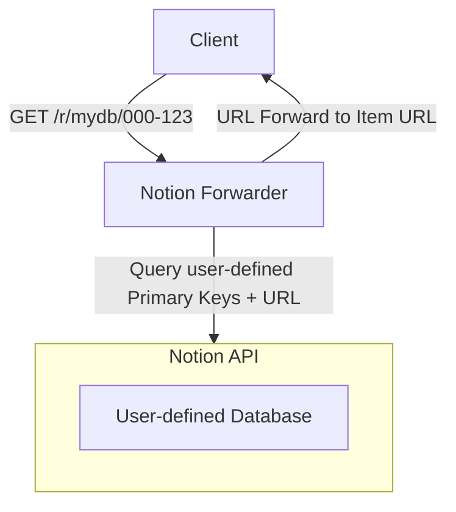

# QR Code Forwarder for Notion

## About

This service reads item IDs from a Notion database and provides them on a endpoint. When accessing the endpoint with the
item ID, the service forwards the request to the Notion item URL. Possible use cases include:

- Scanning QR codes to access Notion items
- Providing a custom URL for Notion items

The Notion database is used as the single source of truth, so the service does not store any data. The basic flow of
data looks like this:



As Notion does not have any webhooks that can notify the forward service when a change is made, this service has to poll
the Notion API in regular intervals or when a request is made.

## Getting Started

## Configuration 

### Environment Variables

- `NFWD_CONFIG_PATH`: Path to the configuration file. Default: `./config.json`

### Configuration File

- `auth`: Notion API token
- `databases`: Array of databases to forward
  - `name`: Name of the database (used in the forwarding service URL)
  - `database_id`: ID of the Notion database (GUID without hyphens)
  - `forward_column_name`: Name of the column that contains the item ID

Example configuration for two forwarded databases:

```json5
{
  "auth": "secret_....",
  "databases": [
    {
      // this part is used when accessing the service endpoint
      "name": "inv",
      // this id can be obtained from the URL when viewing the database in Notion
      "database_id": "5e33117ce6524234a5ea4751eb1adf85",
      // this is the name of the column that contains the item ID
      "forward_column_name": "Asset ID"
    },
    {
      "name": "tools",
      "database_id": "47abc542cb8845cf8ef4c72da8ac829a",
      "forward_column_name": "ID"
    }
  ]
}
```

## Deployment

In order to use this service, follow these steps:

### Create a Notion Integration Token

Currently, the service is deployed as an *Internal
Integration*. [See here for more information](https://developers.notion.com/docs/getting-started#internal-integrations).
This means that the service can only access databases in a single, specific workspace.

Important: You have to be a Workspace Owner to create an integration.

After you've created your Internal Integration, you can obtain the integration secret. It has the form `secret_...`. You
can add this to the `auth` field in the config.json.

### Allow Access to Databases and Copy Database ID

Do not skip this step, as the service will not be able to access the databases otherwise. You have to give the Internal
Integration access for each database you want to forward.
[The Notion documentation has an animation on how to do this](https://developers.notion.com/docs/create-a-notion-integration#give-your-integration-page-permissions).

In addition to this, you need the database ID. The URL to a database is structured like this [Source](https://stackoverflow.com/a/69860478:

```plain
https://www.notion.so/<long_hash_1>?v=<long_hash_2>
```

You can add the value in **long_hash_1** to the `database_id` field in the config.json. Don't forget to add the `name`
and `forward_column_name` fields as well.

### Deploy Service

With Docker:

todo

## Author

Kai Anter - [GitHub](https://github.com/Tanikai) - [Mastodon](https://hachyderm.io/@Tanikai)

## License

This project is licensed under AGPL 3.0.
